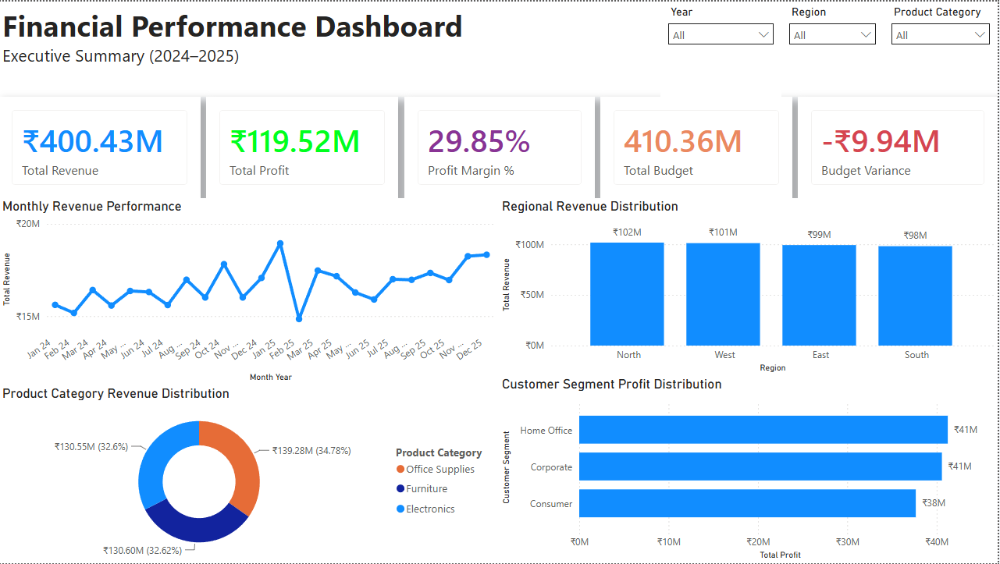
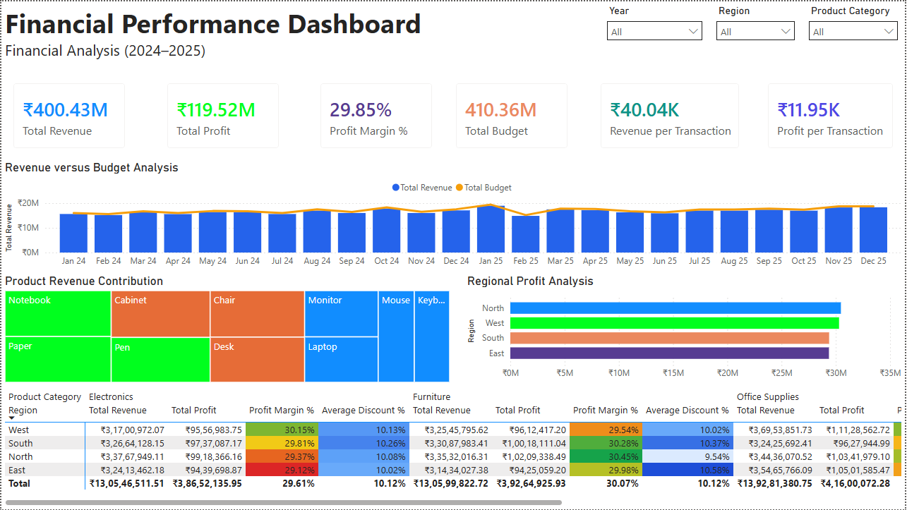
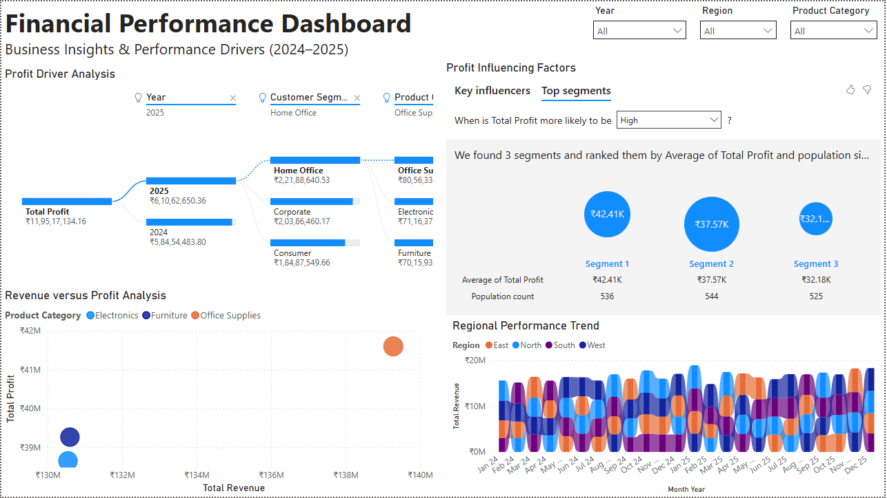

# 📊 Financial Performance Dashboard (Power BI)



## 📌 Project Overview

The **Financial Performance Dashboard** is an interactive Business Intelligence solution built in **Microsoft Power BI** to analyze and monitor financial performance across multiple business dimensions.

The dashboard enables users to explore **Revenue, Profit, Budget, Profit Margin, Customer Segments, Product Categories, Regions, and Business Insights** through dynamic visualizations, KPIs, and interactive filtering.

This project demonstrates practical skills in **Power BI, DAX, Power Query, data modeling, and dashboard design**, making it suitable as a portfolio project for Data Analyst and Business Intelligence roles.

---

# 🎯 Objectives

- Analyze overall business performance
- Track Revenue, Profit, Budget, and Profit Margin
- Compare Revenue against Budget
- Identify high-performing products and regions
- Discover key business drivers using advanced Power BI visuals
- Build an executive-level dashboard with interactive filtering

---

# 📄 Dashboard Pages

## 📈 Page 1 – Executive Summary

Provides a high-level overview of business performance.

### Features

- Total Revenue KPI
- Total Profit KPI
- Profit Margin KPI
- Budget KPI
- Budget Variance KPI
- Monthly Revenue Performance
- Regional Revenue Distribution
- Product Category Revenue Distribution
- Customer Segment Profit Distribution

---

## 💼 Page 2 – Financial Analysis

Provides detailed financial insights.

### Features

- Revenue versus Budget Analysis
- Product Revenue Contribution (Treemap)
- Regional Profit Analysis
- Financial Performance Summary Matrix
- Revenue per Transaction
- Profit per Transaction
- Conditional Formatting

---

## 🔍 Page 3 – Business Insights

Focuses on identifying business drivers.

### Features

- Profit Driver Analysis (Decomposition Tree)
- Profit Influencing Factors (Key Influencers)
- Revenue versus Profit Analysis (Scatter Chart)
- Regional Performance Trend (Ribbon Chart)

---

# 📊 Dashboard Preview

## Executive Summary


---

## Financial Analysis



---

## Business Insights



---

# 🛠️ Tech Stack

- Microsoft Power BI
- Power Query
- DAX (Data Analysis Expressions)
- CSV Dataset
- GitHub

---

# 📈 Key KPIs

- Total Revenue
- Total Profit
- Profit Margin %
- Total Budget
- Budget Variance
- Revenue per Transaction
- Profit per Transaction
- Average Discount %

---

# 📉 Visualizations Used

- KPI Cards
- Clustered Column Chart
- Line & Clustered Column Chart
- Treemap
- Clustered Bar Chart
- Matrix
- Scatter Chart
- Ribbon Chart
- Decomposition Tree
- Key Influencers
- Slicers

---

# 🧮 DAX Measures

The dashboard includes several custom DAX measures, including:

- Total Revenue
- Total Profit
- Total Cost
- Total Budget
- Profit Margin %
- Budget Variance
- Revenue per Transaction
- Profit per Transaction
- Average Discount %
- Total Quantity
- Total Transactions

---

# 📂 Project Structure

```
financial-performance-dashboard-powerbi/
│
├── assets/
│   ├── page1-executive-summary.png
│   ├── page2-financial-analysis.png
│   └── page3-business-insights.png
│
├── Financial_Performance_Dashboard.pbix
├── Financial_Dataset.csv
├── README.md
└── LICENSE
```

---

# 🚀 Skills Demonstrated

- Business Intelligence
- Dashboard Development
- Data Modeling
- Power Query
- DAX Calculations
- Financial Reporting
- KPI Development
- Interactive Dashboard Design
- Data Visualization
- Analytical Storytelling

---

# 📚 Key Business Insights

The dashboard enables users to:

- Monitor overall financial performance
- Compare actual revenue against budget
- Analyze profit across regions and customer segments
- Identify top-performing product categories
- Understand business drivers using Decomposition Tree and Key Influencers
- Explore trends through interactive filtering

---

# 📁 Dataset

This project uses a sample financial dataset created for portfolio and learning purposes.

The dataset contains information related to:

- Revenue
- Cost
- Profit
- Budget
- Discounts
- Regions
- Products
- Product Categories
- Customer Segments
- Transaction Dates

---

# 👨‍💻 Author

**Aakanksh Kumar Marwaha**

- GitHub: https://github.com/AakankshMarwaha
- LinkedIn: www.linkedin.com/in/aakanksh-kumar-marwaha-970023412

---

## ⭐ If you found this project useful, consider giving it a star!
